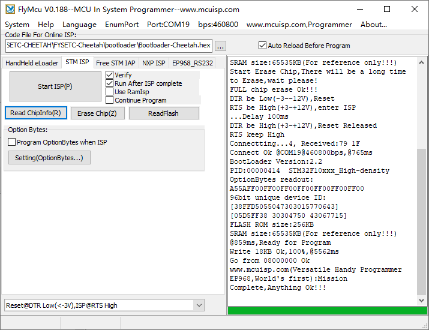
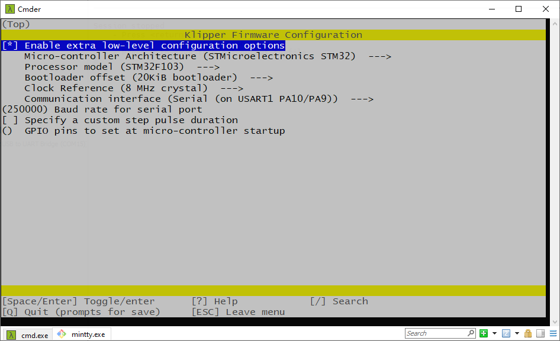

# Bootloader
This is the bootloader for FYSETC Cheetah board.

## Upload bootloader

### Method 1: Upload the bootloader(windows)

This method only works in windows system. You can follow the following steps to upload the bootloader.

- Download the flash software in our github https://github.com/FYSETC/STM32Flasher


- Power the board with power supply and connect the board to your PC with USB cable

- Double the click "FlyMcu.exe" software



- Select `Reset@DTR low(<-3v),ISP @RTS High`

- Click "Port" to select the port of your USB 


- Select `Bootloader-STM32F103.hex` in the `Code File For Online ISP:` edit box. There is bootloader file named `Bootloader-STM32F103.hex` beside this `README` file. 


- At last, click  `Start ISP(p)` button to upload the firmware.


### Method 2 : Upload the bootloader(linux)

This method only works in linux system.

#### Load usb driver

Delete the old version driver /lib/modules/$(uname -r)/kernel/drivers/usb/serial/ch341.ko

```
rm /lib/modules/$(uname -r)/kernel/drivers/usb/serial/ch341.ko
```

Download the CH34x driver(linux version) from our github

https://github.com/FYSETC/CH340-Driver

follow the readme.txt to make and load the driver .

If you want the driver load automatically every time your PC power up. You can copy the ch34x.ko file to 

directory /lib/modules/$(uname -r)/kernel/drivers/usb/serial/ , and do

```
depmod 
```

#### Install stm32flash tool

First get the code

```
git clone https://git.code.sf.net/p/stm32flash/code stm32flash-code
```

Then follow the INSTALL file to install the software

#### Upload the bootloader

Connect the motherboard with USB cable and your PC. And do

```
dmesg
```

And you will get message like 


the ttyUSB0 is the port to communicate with the motherboard.

And then go the the firmware.hex file location directory and do the follow command to upload the firmware

```
 stm32flash -w Bootloader-STM32F103.hex -v -i rts,-dtr /dev/ttyUSB0
```

## Follow-up work

### Marlin firmware

This bootloader default boot address is `0x8005000`, so if you want to use this bootloader you need to change the firmware  flash address to `0x8005000`.

You need to add the following lines to Marlin file `Marlin\buildroot\share\PlatformIO\scripts\fysetc_STM32F1.py`

```
# Relocate firmware from 0x08000000 to 0x08005000
for define in env['CPPDEFINES']:
    if define[0] == "VECT_TAB_ADDR":
        env['CPPDEFINES'].remove(define)
env['CPPDEFINES'].append(("VECT_TAB_ADDR", "0x08005000"))

custom_ld_script = os.path.abspath("buildroot/share/PlatformIO/ldscripts/fysetc_stm32f103rc.ld")
for i, flag in enumerate(env["LINKFLAGS"]):
    if "-Wl,-T" in flag:
        env["LINKFLAGS"][i] = "-Wl,-T" + custom_ld_script
    elif flag == "-T":
        env["LINKFLAGS"][i + 1] = custom_ld_script
```

You can add it after the line 

```
Import("env")
```

And change the following line in `Marlin\buildroot\share\PlatformIO\ldscripts\fysetc_stm32f103rc.ld`

```
rom (rx)  : ORIGIN = 0x08005000, LENGTH = 256K - 20K
```

And then rebuild the firmware.

### Klipper firmware

You need to select `20KiB bootloader`



## Upload firmware with sdcard

After you upload the bootloader and build the firmware, now you can upload it to the board with sdcard

1. Copy the `firmware.bin`(if you use `Klipper` firmware, please rename `klipper.bin` to `firmware.bin`) to the SD card , you need to be sure the firmware name is `firmware.bin`. 
2. And then power off the machine.
3. Insert the SD card to the board.
4. Power on the machine. 
5. And wait for 10~20 seconds (larger the firmware, more time need), it will be done. 

You can check if the `firmware.bin` file in the sdcard been changed to `old.bin`, if so, means success.
